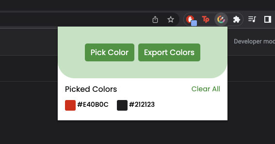

# Chrome Colour Picker Extension

### What is this?
This is a Google Chrome Extension coded in HTML, CSS, and JavaScript. This color picker extension allows you to click anywhere on the page to get its hex/rgb color values. Features include 'copy' function upon clicking on the color values, clearing picked colors list, and exporting color values to a file. 

### How to use this:
1 . Download all project files.
2 . Open Google Chrome.
3 . Navigate to Settings -> Extensions -> Manage Extensions.
4 . Enable Developer mode.
5 . Click on Load unpacked and select the project file.
6 . Chrome extension should now be loaded. 

# Preview
Here is a project preview:

